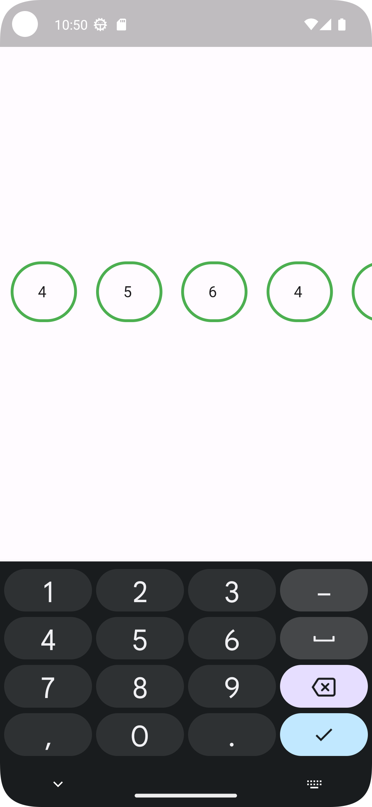
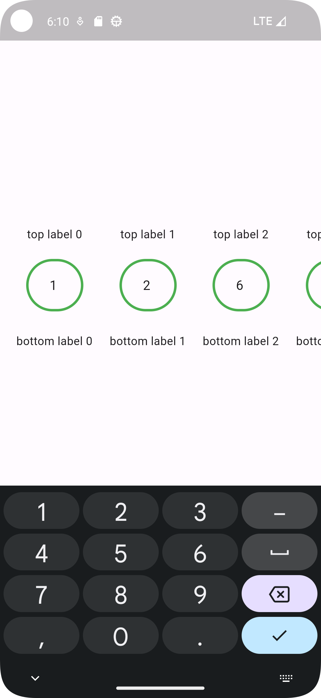
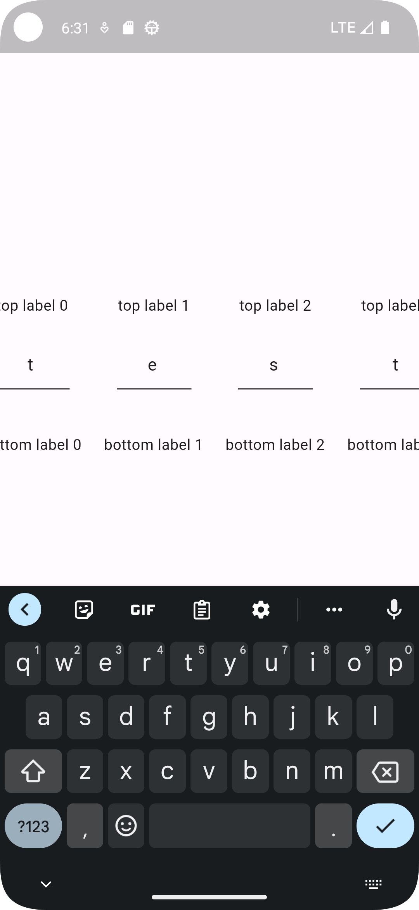

## Features

This library is a dynamic single text field (it is like PIN code but has not PIN functionalities)
with top/bottom text label, and different customizations.

## Getting started

Version Minimum Flutter SDK: 3.0.0

Tested Versioning: <br />
Flutter SDK version: 3.22.1 <br />
Dart Version: 3.4.1 <br /> <br />

## Usage

<a title="simulator_image"></a>

```dart

final List<SingleTextModel> singleTextModelList = [];

@override
void initState() {
  List.generate(
      7,
          (index) =>
          singleTextModelList.add(SingleTextModel(
              singleText: "",
              topLabelText: "top label $index",
              bottomLabelText: "bottom label $index")));
  super.initState();
}

InputBorder getInputBorder() =>
    const OutlineInputBorder(
      borderSide: BorderSide(
        color: Colors.green,
        width: 3,
      ),
      borderRadius: BorderRadius.all(
        Radius.circular(
          70,
        ),
      ),
    );

@override
Widget build(BuildContext context) {
  return Scaffold(
    body: Column(
      mainAxisAlignment: MainAxisAlignment.center,
      children: [
        SizedBox(
          height: MediaQuery
              .of(context)
              .size
              .height / 3,
        ),
        DynamicSingleTextField(
          singleTextModelList: singleTextModelList,
          showLabelsType: ShowLabelsTypeEnum.hide_labels_type,
          inputBorder: getInputBorder(),
          topLabelMarginBottom: 20,
          bottomLabelMarginTop: 20,
          enableInputBorder: getInputBorder(),
          disableInputBorder: getInputBorder(),
          focusedInputBorder: getInputBorder(),
          textInputType: TextInputType.number,
          onChangeSingleText: (String value, int index) {
            if (kDebugMode) {
              print("value: $value index: $index");
            }
          },
          onValidationBaseOnLength: () {
            if (kDebugMode) {
              print("validated");
            }
          },
        ),
      ],
    ),
  );
}
```

<a title="simulator_image"></a>

```dart

final List<SingleTextModel> singleTextModelList = [];

@override
void initState() {
  List.generate(
      7,
          (index) =>
          singleTextModelList.add(SingleTextModel(
              singleText: "",
              topLabelText: "top label $index",
              bottomLabelText: "bottom label $index")));
  super.initState();
}

InputBorder getInputBorder() =>
    const OutlineInputBorder(
      borderSide: BorderSide(
        color: Colors.green,
        width: 3,
      ),
      borderRadius: BorderRadius.all(
        Radius.circular(
          70,
        ),
      ),
    );

@override
Widget build(BuildContext context) {
  return Scaffold(
    body: Column(
      mainAxisAlignment: MainAxisAlignment.center,
      children: [
        SizedBox(
          height: MediaQuery
              .of(context)
              .size
              .height / 3,
        ),
        DynamicSingleTextField(
          singleTextModelList: singleTextModelList,
          showLabelsType: ShowLabelsTypeEnum.show_both_labels_type,
          inputBorder: getInputBorder(),
          topLabelMarginBottom: 20,
          bottomLabelMarginTop: 20,
          enableInputBorder: getInputBorder(),
          disableInputBorder: getInputBorder(),
          focusedInputBorder: getInputBorder(),
          textInputType: TextInputType.number,
          onChangeSingleText: (String value, int index) {
            if (kDebugMode) {
              print("value: $value index: $index");
            }
          },
          onValidationBaseOnLength: () {
            if (kDebugMode) {
              print("validated");
            }
          },
        ),
      ],
    ),
  );
}
```

<a title="simulator_image"></a>

```dart

final List<SingleTextModel> singleTextModelList = [];

@override
void initState() {
  List.generate(
      7,
          (index) =>
          singleTextModelList.add(SingleTextModel(
              singleText: "",
              topLabelText: "top label $index",
              bottomLabelText: "bottom label $index")));
  super.initState();
}

InputBorder getInputBorder() =>
    const OutlineInputBorder(
      borderSide: BorderSide(
        color: Colors.green,
        width: 3,
      ),
      borderRadius: BorderRadius.all(
        Radius.circular(
          70,
        ),
      ),
    );

@override
Widget build(BuildContext context) {
  return Scaffold(
    body: Column(
      mainAxisAlignment: MainAxisAlignment.center,
      children: [
        SizedBox(
          height: MediaQuery
              .of(context)
              .size
              .height / 3,
        ),
        DynamicSingleTextField(
          singleTextModelList: singleTextModelList,
          showLabelsType: ShowLabelsTypeEnum.show_both_labels_type,
          inputBorder: getInputBorder(),
          topLabelMarginBottom: 20,
          bottomLabelMarginTop: 20,
          textInputType: TextInputType.text,
          onChangeSingleText: (String value, int index) {
            if (kDebugMode) {
              print("value: $value index: $index");
            }
          },
          onValidationBaseOnLength: () {
            if (kDebugMode) {
              print("validated");
            }
          },
        ),
      ],
    ),
  );
}
```

## Additional information

Thank you for using my package, any feedback is welcome. You can report any bug, ask a question on package GitHub repository.
https://github.com/NicosNicolaou16/dynamic_single_text_field/issues